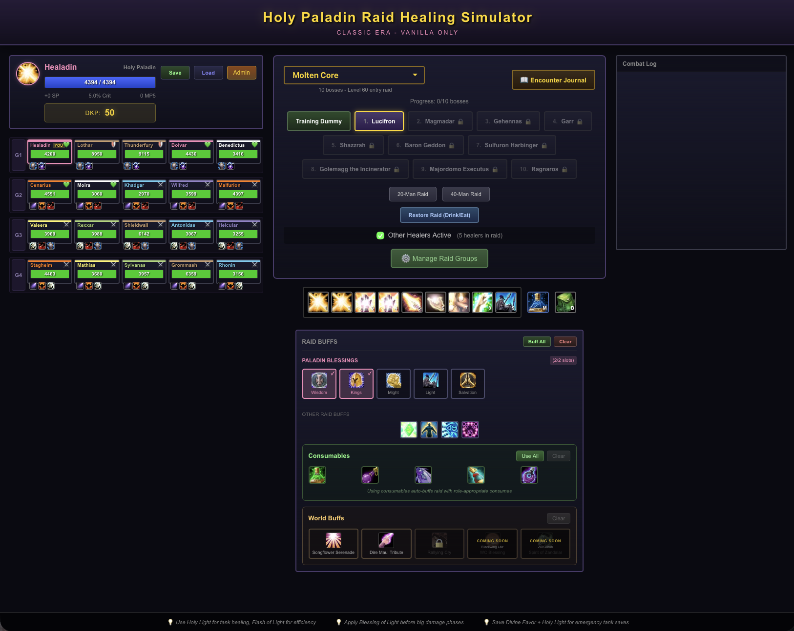

# Classic WoW Raid Simulator

A browser-based Classic WoW (Vanilla) raid healing simulator. Experience the nostalgia of healing Molten Core and Onyxia's Lair with authentic spell mechanics, boss abilities, and raid management systems.

## Play Now

**https://classicwowraidsim.com**

No download required - play directly in your browser!

## Features

### Playable Classes
- **Holy Paladin** (Alliance) - 9 spells including Holy Light, Flash of Light, Holy Shock, Lay on Hands, Divine Favor, Cleanse, and Blessing of Light
- **Restoration Shaman** (Horde) - Chain Heal, Healing Wave, Lesser Healing Wave, Earth Shield, and more
- More classes coming soon!

### Raid Content
- **Molten Core** - All 10 bosses with authentic abilities
  - Lucifron, Magmadar, Gehennas, Garr, Shazzrah, Baron Geddon, Sulfuron Harbinger, Golemagg, Majordomo Executus, and Ragnaros
- **Onyxia's Lair** - 3-phase dragon encounter
  - Ground phase with Cleave, Tail Sweep, and Flame Breath
  - Air phase with Deep Breath, Fireballs, and Whelp swarms
  - Chaos phase with Bellowing Roar fear and Lava Eruptions
- **Training Dummy** - Practice your healing rotation without pressure

### Boss Mechanics
- Tank damage, raid-wide AoE, and random target abilities
- Dispellable debuffs (Magic, Poison, Disease, Curse indicators)
- Phase transitions (Onyxia)
- Enrage timers
- Living Bomb safe zone mechanic
- Encounter Journal with boss abilities and healer tips

### Raid Management
- **20-man or 40-man raids** - Adjustable raid size
- **8 WoW classes** represented with authentic class colors
- **Role system** - Tanks, Healers, and DPS with appropriate health pools
- **Other healers toggle** - Enable/disable AI healing from other raid healers
- **Raid buff system** - Paladin Blessings, class buffs (Arcane Intellect, Mark of the Wild, etc.)

### Progression Systems
- **DKP (Dragon Kill Points)** - Earn points for boss kills, spend on loot
- **Loot drops** - Epic gear with stats (Intellect, Spell Power, Healing Power, MP5, Crit)
- **Equipment system** - 9 gear slots per character
- **Gear Score** - Track your raid's power level
- **Bad Luck Protection** - Guaranteed loot after consecutive unlucky drops

### Legendary Crafting
- **Sulfuras, Hand of Ragnaros** - Collect Eye of Sulfuras from Ragnaros
- **Thunderfury, Blessed Blade of the Windseeker** - Collect both Bindings from Garr and Baron Geddon

### Consumables & World Buffs
- **Consumables** - Mana potions, Flask of Distilled Wisdom, Mageblood Elixir, and more
- **World Buffs** - Rallying Cry of the Dragonslayer (unlocked by defeating Onyxia)

### Multiplayer Co-op
- **Room codes** - Create or join lobbies with up to 4 healers
- **Real-time healing meter** - See everyone's HPS
- **DKP loot bidding** - Bid on drops with your raid team

### Cloud Saves
- **Google & Apple Sign-In** - Sync your progress across devices
- **Automatic cloud sync** - Never lose your character again

### Quality of Life
- **Save/Load system** - Multiple save slots with import/export
- **Admin Panel** - Manage loot, DKP, progression, and raid composition
- **Combat Log** - Real-time logging of heals, damage, and events
- **Keyboard shortcuts** - Number keys 1-9 for spells, M for mana potion, B for bags, ESC to cancel

## Controls

| Key | Action |
|-----|--------|
| 1-9 | Cast spell from action bar |
| M | Use Major Mana Potion |
| B | Open Bags/Inventory |
| ESC | Cancel cast / Stop encounter |

## Tech Stack

- **React 19** - UI framework
- **TypeScript** - Type safety
- **Vite** - Build tool
- **Supabase** - Auth & database

## Acknowledgments

- Inspired by the Classic WoW healing experience
- Spell icons from [Wowhead](https://www.wowhead.com/)
- Boss mechanics referenced from vanilla WoW documentation

## License

This project is for educational and entertainment purposes. World of Warcraft and all related imagery are trademarks of Blizzard Entertainment.

---

*"Did someone say [Thunderfury, Blessed Blade of the Windseeker]?"*
